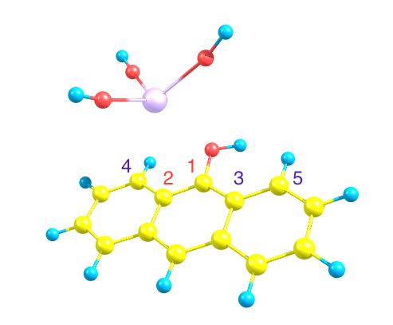
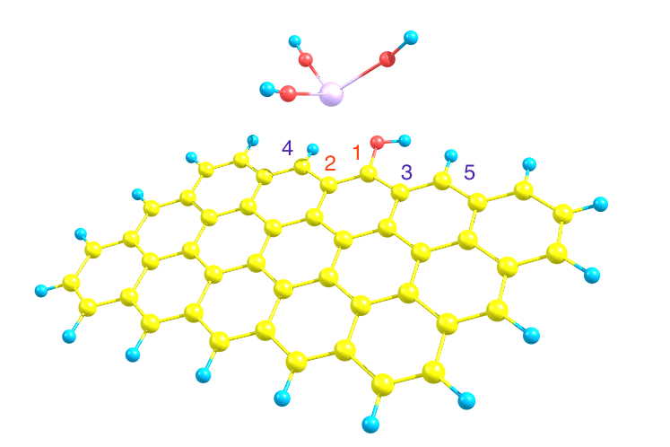

#Atomic Transposition of Atoms on 2D Surface Complexes 

This algorithm was implemented to transpose atoms oriented relative to a 2D surface complex such as graphene oxide, set in a certain coordinate system, onto *another* 2D surface in a different coordinate system.

The algorithm uses Sympy and Math libraries.

#Data File Setup 

This script requires a data file set up in the following way, without spaces in between data.  File reading is performed by the script until a space is found, so any data that is relevant but not to be read can be stored after spaces, below the relevant data.  

- Surface 1, 3D Coordinate 1
- Surface 1, 3D Coordinate 2
- Surface 1, 3D Coordinate 3
- Surface 1, 3D Coordinate 4
- Surface 1, 3D Coordinate 5
- Surface 2, 3D Coordinate 1
- Surface 2, 3D Coordinate 2
- Surface 2, 3D Coordinate 3
- Surface 2, 3D Coordinate 4
- Surface 2, 3D Coordinate 5
- All atomic coordinates in terms of first coordinate system
	- Must be 4 columns, leading with atomic symbol 

** The first two coordinates from each surface must be RELATIVE TO EACH OTHER in order for transposition to be performed properly **

The following two pictures are examples of transposition results, with the corresponding atomic coordinates labeled as 1, 2, 3, 4, 5.  1 and 2 are marked in RED because they MUST be relative to one another. 




Script run with on the command line in the following way:

```python 
python transpose.py sampleData.txt 
```

